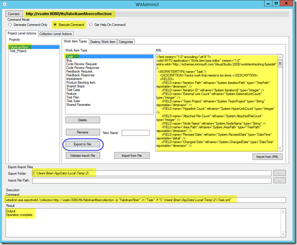
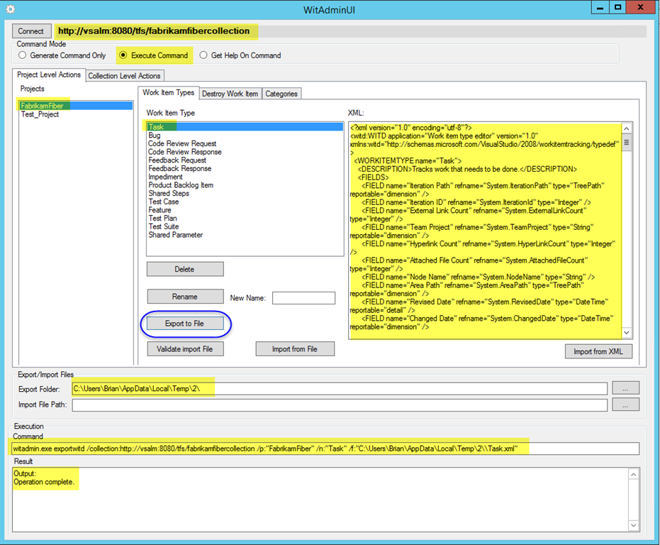
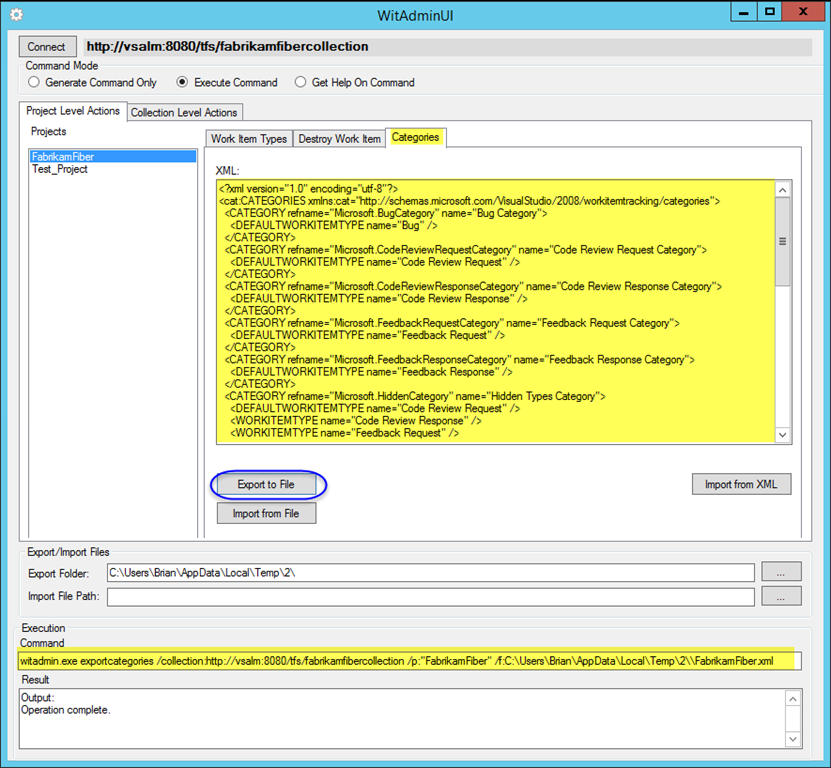
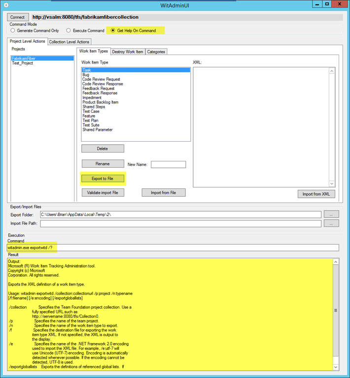
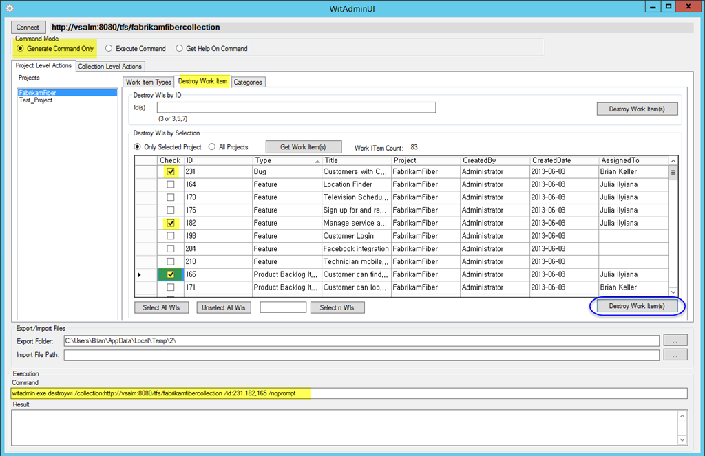
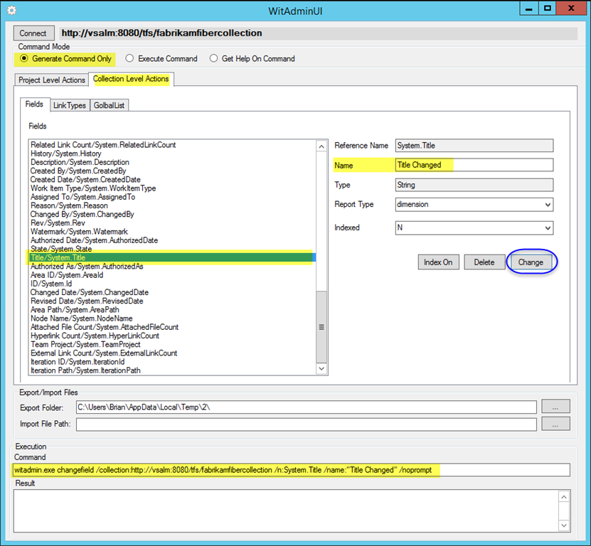
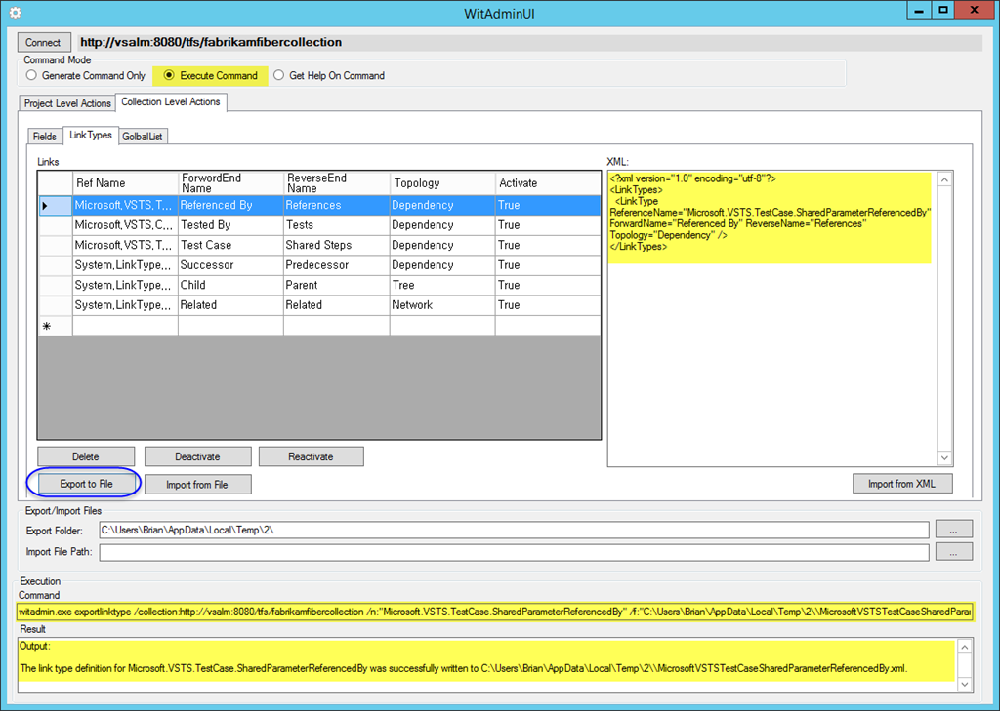
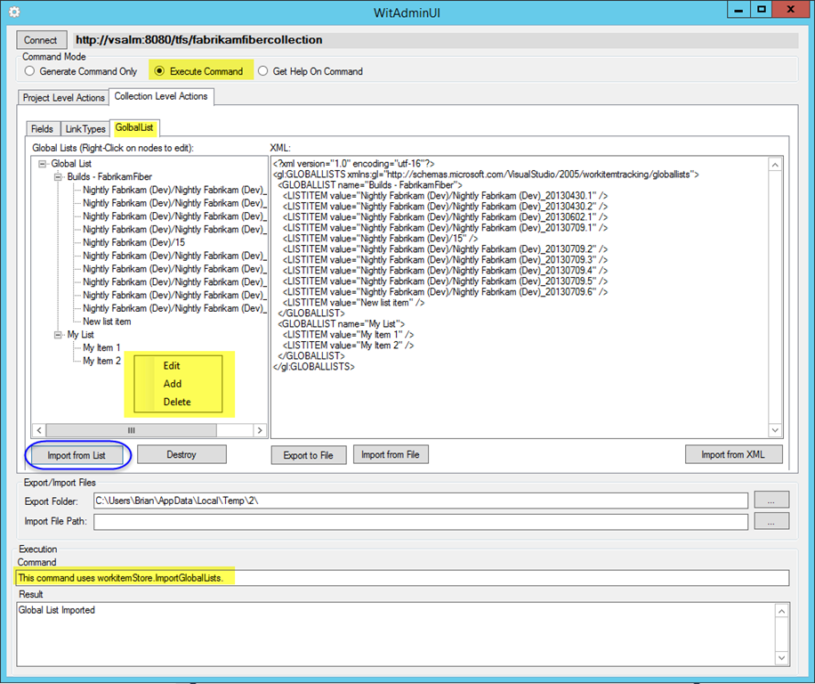

**TFS WitAdminUI** is a simple wrapper around the **_witadmin_** command-line tool offering various features.

### Supported Versions

**TFS WitAdminUI** currently supports TFS versions:
- 2017 and all updates
- 2015
- 2013

**TFS WitAdminUI** currently supports VSTS in the following way:

"_For Hosted XML and Inheritance process models, you can only use witadmin commands to list information._" [MSDN](https://msdn.microsoft.com/en-us/library/dd236914.aspx)

## Usage

[Witadmin](https://msdn.microsoft.com/en-us/library/dd236914.aspx") is a command-line tool which comes with Visual Studio. As described in [MSDN](https://msdn.microsoft.com/en-us/library/dd236914.aspx), "_By using the **witadmin** command-line tool, you can create, delete, import, and export objects such as categories, global lists, global workflow, types of links, and types of work items. You can also permanently delete types of work item types, and you can delete, list, or change the attributes of fields in work item. As the following illustration shows, you manage categories and types of and work items for each team project. You manage global lists, types of links, and fields in work item for each team project collection. You can customize global workflow for a team project or a collection._"

When working on customizing a process template, you need to perform several **_witadmin_** actions multiple times, and since it is a command line tool, it gets pretty bothersome composing the long commands over and over again with poor support for copy-paste actions. [TFS WitAdminUI](https://github.com/aroje/WitAdminUI) helps you by automatically generating commands based on the project collection and team project you are connected to. It allows you to preview generated commands with parameters for several **_witadmin_** actions, get help on those actions and execute them against the selected project collection and team project.

_Note: The application uses **witadmin** tool from Visual Studio 2013. It was not tested against earlier versions of Team Foundation Server, but it should work due to backward compatibility of the **witadmin**  tool._

_Note: The original code was taken from the CodePlex project [TFS WitAdminUI](http://witadminui.codeplex.com), and it was refactored and extended._

## Connecting to TFS

**TFS WitAdminUI** lets you connect to a Team Foundation Server of your choice at load time. You can later change this connection while the program is running by using the **Connect** button. All commands are executed in the context of the selected TFS connection.

### Command Modes

There are 3 different **Command Modes**:
	
#### **Generate Command Only**
	
Generates the **_witadmin_** command-line with appropriate parameters and shows it in the **Command** edit box in the **Execution** group at the bottom of the window.

**This mode does not execute any commands against TFS!**
	

#### **Execute Command**
	
Generates the **_witadmin_** command-line with appropriate parameters and **executes** it against the selected project collection and team project.

The command is generated using the same code as in the **Generate Command Only**mode.

The result is displayed in the **Result** edit box in the **Execution** group at the bottom of the window.

#### **Get Help On Command**
	
Runs the command-line to get help on a particular action implemented in the application. (_witadmin [action] /?_).

The result is displayed in the **Result **edit box in the **
Execution** group at the bottom of the window.

## Project Level Actions
The tab **Project Level Actions** contains commands which are **executed against a team project**. You need to select the appropriate team project in the **Projects** list.

### **Work Items Types** tab

Implements actions related to **handling work item types**:

- **Delete** - _destroywitd_
- **Rename** - _renamewitd_
- **Export to File** - _exportwitd_
- **Validate** - _importwitd /v_
- **Import from File** - _importwitd_
- **Import from XML** - _importwitd_

All actions are executed against the work item type selected in the **Work Item Type** list.

When exporting, the path set under **Export Folder** in the **Export/Import Files** group is used. The file name is generated based on the work item type name. Additionally the exported file is loaded in the **XML** edit box.

When importing from file, the file from the **Import File Path** in the **Export/Import Files** group is used.
When importing from XML, the XML from the **XML** edit box is used.

### **Destroy Work Item** tab

Implements actions related to **destroying work items** (_destroywi_) from the selected collection and projects.
You can **destroy work items by IDs** you manually enter in the **Id(s)** edit box in the **Destroy WIs by ID** group.

You can **destroy work items by selecting** them from the list of work items in the **Destroy WIs by Selection** group.

Populate the list using the **Get Work Item(s)** button either from the selected team project (**Only Selected Projects** radio) or from all team project in the collection (**All Projects** radio). Use the **Select All WIs**, **Unselect All WIs**, **Select n WIs** buttons to adjust your selection.

### **Categories** tab

Implements actions related to **managing categories** for the selected team project:
- **Export** - _exportcategories_
- **Import** - _importcategories_

When exporting, the path set under **Export Folder** in the **Export/Import Files** group is used. The file name is generated based on the team project name. Additionally the Exported file is loaded in the **XML** edit box.
When importing from file, the file from the **Import File Path** in the **Export/Import Files** group is used.
When importing from XML, the XML from the **XML** edit box is used.

## Collection Level Actions
The tab **Collection Level Actions** contains commands which are executed against the project collection you are connected to.

### **Fields** tab

Implements actions related to **handling work item fields** in the selected project collection:
- **Index On** - _indexfield_
- **Delete** - _deletefield_
- **Change** - _changefield_

### **Link Types** tab

Implements actions related to **managing link types** in the selected project collection:
- **Delete** - _deletelinktype_
- **Deactivate** - _deactivatelinktype_
- **Reactivate** - _reactivatelinktype_
- **Export to File** - _exportlinktype_
- **Import from File** - _importlinktype_
- **Import from XML** - _importlinktype_

When exporting, the path set under **Export Folder** in the **Export/Import Files** group is used. The file name is generated based on link type name. Additionally the exported file is loaded in the **XML** edit box.

When importing from file, the file from the **Import File Path** in the **Export/Import Files** group is used.

When importing from XML, the XML from the **XML** edit box is used.

### **Global List** tab
Implements actions related to **managing global lists** for the selected project collection:
- **Import from List** - uses method _WorkItemStore.ImportGlobalList_
- **Destroy** - _destroygloballist_
- **Export to File** - _exportgloballist_
- **Import from File** - _importgloballist_
- **Import from XML** - _importgloballist_

When exporting, the path set under **Export Folder** in the **Export/Import Files** group is used. The file name is generated based on the TFS server name and project collection name. Additionally the exported file is loaded in the **XML** edit box.
When importing from file, the file from the **Import File Path** in the **Export/Import Files** group is used.
When importing from XML, the XML from the **XML** edit box is used.
When importing from list, the XML for import is generated from the contents of the **Global List** tree.
By right clicking on a particular tree node you get the options to **Edit**/**Add**/**Delete** that node. The XML imported to TFS is loaded in the **XML** edit box.

